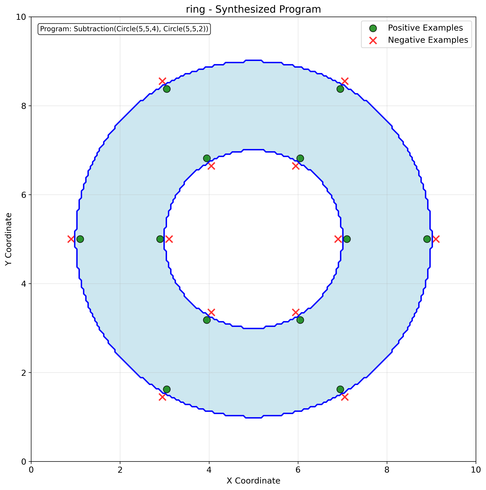

# EN.601.727 Machine Programming - Assignment 1

🎉 Welcome to your very first assignment in Machine Programming!

In this journey, you’ll get your hands dirty with inductive program synthesis, starting with a bottom-up synthesizer, and ending with a taste of LLM-powered synthesis.
Think of it as teaching a machine how to invent programs from scratch, and then inviting an AI assistant to join the fun.

### ✨ Structure

This assignment has three interconnected parts that gradually build on one another:

- **Shapes DSL (Warm-up with Geometry)**
  Explore a small domain-specific language (DSL) for geometric shapes. You’ll implement a bottom-up synthesizer that automatically generates shape expressions based on positive and negative coordinates.
- **Strings DSL (From Shapes to Strings)**
  Design a DSL for string manipulation—your own mini “string toolkit.” Then, reuse (and slightly adapt) your synthesizer from Part 1 to automatically generate string-processing programs.
- **LLM-Assisted Synthesis (Humans + Machines)**
  Put a large language model (LLM) to work! Using the DSL you designed in Part 2, craft prompts that guide the LLM to synthesize string manipulation programs. Then, analyze what it gets right—and where it stumbles.

### 📦 Deliverables and Submission

You will implement several key functions for each part:

- **Part 1: Bottom-up Synthesis for Shapes**
  - `shape_synthesizer.py`: `grow()`
  - `enumerative_synthesis.py`: `eliminate_equivalents()`
  - `enumerative_synthesis.py`: `synthesize()`
- **Part 2: Bottom-up Synthesis for Strings**
  - `strings.py`: (add your new string operations)
  - `string_synthesizer.py`: `grow()`
- **Part 3: LLM Synthesis for Strings**
  - `llm_string_synthesizer.py`: `generate_prompt()`
  - `llm_string_synthesizer.py`: `extract_program()`

### 📌 Grading criteria:

- **Parts 1 & 2**: Autograded. Full credit if you pass all tests within 10 minutes of runtime.
  (Hint: the reference solution runs most tasks in <1s, hardest ones in <10s.)
- **Part 3**: Autograded. Your LLM must solve at least 80% of test cases.
  Upload your `llm_synthesis_report.jsonl` with all prompts/responses.

For Gradescope submission, zip the following 6 (or 7) files:
- `strings.py`
- `enumerative_synthesis.py`
- `shape_synthesizer.py`
- `string_synthesizer.py`
- `llm_string_synthesizer.py`
- `llm_synthesis_report.jsonl`
- (Optional) `acknowledgements.md` — for notes, acknowledgements, and AI/collaboration credits, specified below.

### 🤝 Collaboration Policy

You are encouraged to discuss ideas with peers.
Do not copy code directly.
Implement your own solution.
If you collaborate (e.g., pair programming, brainstorming), credit your collaborators clearly in your `acknowledgements.md`.

### 🤖 Using AI in This Assignment

This is a Machine Programming course—of course you can use LLMs!
LLMs can be great debugging partners, but they won’t give you a working solution right away.
Prompt iteratively, and show that you understand the synthesis algorithms.
Save interesting prompts + responses, and include them in your `acknowledgements.md`.
Be explicit about which model you used.

### 🔑 LLM API Key for Part 3

We’ll provide each of you with a Google Gemini API key for Part 3.
The key is for this course only.
Please do not share it, especially outside of the class.
Typical usage for this assignment should not exceed $10.
Excessive usage will be monitored, and we may revoke keys if abused.

### 🧭 Integrity Guidelines

- **Parts 1 & 2**: It’s fine to add smart heuristics in your DSL or synthesizer, but don’t hardcode answers to test cases—that defeats the purpose.
- **Part 3**: Don’t fake the LLM’s output in your `.jsonl` report. Both successes and failures are valuable learning outcomes in this course.

### 📚 Reference

The design of the synthesizer and the Shape DSL is adapted from [pset1](https://people.csail.mit.edu/asolar/SynthesisCourse/Assignment1.htm) in MIT’s [Introduction to Program Synthesis](https://people.csail.mit.edu/asolar/SynthesisCourse/index.htm), taught by [Prof. Armando Solar-Lezama](https://people.csail.mit.edu/asolar/).

# 🚀 Part 0: Setting Up

First things first—let’s get your environment ready.

1. **Clone the repository**

   ```bash
   git clone https://github.com/machine-programming/assignment-1
   ```

2. **Move into the assignment directory, create virtual environments, and install dependencies**

   ```bash
   cd assignment-1
   python -m venv .venv # creating a virtual environment for this assignment
   source .venv/bin/activate # change this to other activate scripts if you use shells like fish
   pip install -r requirements.txt # install the dependencies
   ```

3. **Test your setup (don’t panic if it fails!)**

   ```bash
   python test_part1.py
   ```

   You should see the tests run but **all of them fail**.
   ✅ That’s exactly what we expect. Your job in Part 1 is to turn those failures into passes!


# 🎨 Part 1: Bottom-up Synthesis for Shapes



In this part, we’ll explore a Domain-Specific Language (DSL) for shapes.
This DSL gives you a palette of basic shapes (rectangle, triangle, circle) and shape operations (union, intersection, mirror, subtraction).

At its core, a shape $f$ is just a boolean function:

$$f(x, y) \mapsto \texttt{true}~|~\texttt{false}$$

- `true` means that point $(x, y)$ falls within the shape $f$,
- `false` means that the point $(x, y)$ falls outside of the shape $f$.

### 🎯 Goal of synthesis

Given a set of points with positive/negative labels (`List[Tuple[float, float, bool]]`), synthesize a shape program such that:
- All positive points fall inside the shape
- All negative points stay outside

The image above shows an example with 12 positive and 12 negative points.
The expected synthesized program was `Subtraction(Circle(5,5,4), Circle(5,5,2))`, which produces a ring.

### 🧪 Running the Synthesizer on Test Cases

To actually apply your synthesizer to the provided test cases, run:

``` bash
python test_part1.py
```

- At the beginning: you should see synthesis failures (don’t worry—that’s expected).
- A new folder called `shape_visualization/` will be created. Inside, you’ll find:
  - Visualization of examples: e.g., `ring_examples.png` (positive/negative coordinates)
  - Visualization of synthesized program: e.g., `ring_synthesized.png` which is the same as the image above
- If a test case fails, you’ll only see the examples file (no synthesized visualization).
- Use these visualizations to get an intuition for what kind of program your synthesizer should be generating.

Once you complete Part 1, rerun this test.
You should start seeing synthesized shapes that match the examples.
It’s also helpful to peek at test_part1.py to see the full set of test cases.

### 🧩 Understanding the DSL

Shapes are implemented in shapes.py.
The base class is `Shape`, which all concrete shapes inherit from.
Each shape must implement the method `interpret(xs, ys)`, which takes two numpy arrays (`x` and `y` coordinates) and returns a boolean array.

Example: the `Circle` class inherits from `Shape`:

``` python
class Circle(Shape):
    def interpret(self, xs: np.ndarray, ys: np.ndarray) -> np.ndarray:
        return ((xs - self.center.x)**2 + (ys - self.center.y)**2) <= self.radius**2
```

The `interpret` function computes whether each coordinate lies inside the circle (using vectorized numpy operations for speed).

### 📜 Formal DSL Syntax

```
Shape ::= Circle(center: Coordinate, radius: int)
        | Rectangle(bottom_left: Coordinate, top_right: Coordinate)
        | Triangle(bottom_left: Coordinate, top_right: Coordinate)   # right triangle only
        | Mirror(Shape)  # across line y=x
        | Union(Shape, Shape)
        | Intersection(Shape, Shape)
        | Subtraction(Shape, Shape)
```

- **Terminals**: `Circle`, `Rectangle`, `Triangle` (with fixed parameters)
- **Operators**: `Mirror`, `Union`, `Intersection`, `Subtraction`

### 🔨 Part 1(a). Growing Shapes

Time to roll up your sleeves! Head to `shape_synthesizer.py` and open the `ShapeSynthesizer` class.
This synthesizer inherits from `BottomUpSynthesizer` but specializes in shapes.
Your task is to implement `grow()`, which:

- Takes a current set of shape programs.
- Applies shape operators (union, subtraction, etc.) to generate new programs one level deeper.
- Returns a set that includes both the original programs and the newly grown ones.

Once implemented, your `grow()` function will be the engine that drives bottom-up search over the DSL, which step by step builds increasingly complex shapes.

``` python
# TODO
def grow(
    self,
    program_list: List[Shape],
    examples: List[Tuple[float, float, bool]]
) -> List[Shape]:
```

### 🔨 Part 1(b). Eliminating Observationally Equivalent Shapes

Now that you can **grow** shapes, the next challenge is to keep your search space from exploding.
For this, we’ll turn to the more general `BottomUpSynthesizer` (in `enumerative_synthesis.py`) and implement a pruning step: **eliminating observationally equivalent programs**.

Two programs are **observationally equivalent** if they produce the **same outputs** on the **same inputs**. For example, look at these two programs:
* `Union(Circle(0,0,1), Circle(0,0,1))`
* `Circle(0,0,1)`

These two programs are *different syntactically* but *indistinguishable observationally* (their outputs match on all given test points).

Your job is to filter out duplicates like these so the synthesizer only keeps *unique behaviors*. Please implement the `eliminate_equivalents` function:

```python
# TODO
def eliminate_equivalents(
    self,
    program_list: List[T],
    test_inputs: List[Any],
    cache: Dict[T, Any],
    iteration: int
) -> Generator[T, None, Dict[T, Any]]:
```

* **`program_list`**: candidate programs to check
* **`test_inputs`**: inputs on which programs will be interpreted
* **`cache`**: a dictionary (`Dict[T, Any]`) mapping each program → its output signature
* **`iteration`**: current synthesis round (useful for debugging/logging)
* **Return**: a **generator** that yields only the *observationally unique* programs

### 🔨 Part 1(c). Bottom-up Synthesizing Shapes

Now it’s time to put everything together! You’ve implemented **growing** shapes and **eliminating duplicates**—the final step is to iteratively **synthesize a shape that matches all the examples**.

Head to the function `synthesize()` in `BottomUpSynthesizer` under the file `enumerative_synthesis.py`:

```python
# TODO
def synthesize(
    self,
    examples: List[Any],
    max_iterations: int = 5
) -> T:
```

The **bottom-up synthesis loop** works like this:

1. **Start with terminals**

   * Generate the set of all terminal programs (`generate_terminals()`) and store them.

2. **Iterate up to `max_iterations` times**:

   * **Grow**: expand the program set one level deeper using `grow()`.
   * **Eliminate equivalents**: prune duplicates with `eliminate_equivalents()`.
   * **Check for success**: while pruning (remember that we are using `yield`), see if any program satisfies all examples using `is_correct()`.
     * If yes → 🎉 return that program immediately.
     * Otherwise → continue expanding.

If no solution is found after `max_iterations`, you may `raise ValueError` (which is already provided).

### ⚡ Expected Outcome

Once you’ve implemented all three core functions, it’s time to test your synthesizer:

```bash
python test_part1.py
```

If all goes well, you’ll see your synthesizer solving the test cases one by one.
The goal right now would be to make it faster.

Make sure your synthesizer can pass all test cases within **10 minutes** on GradeScope.
For reference, our solution takes about **30 seconds** to pass all test cases (sequentially) on a MacBook Pro with an Apple M1 Pro chip and Python 3.13.0:

```bash
============================================================
PART 1: GEOMETRIC SHAPE DSL TESTS
============================================================
...
----------------------------------------------------------------------
Ran 24 tests in 28.628s

OK
```

✨ Congratulations—you’ve just built your first **bottom-up program synthesizer**!

# 🧵 Part 2: Bottom-up Synthesis for Strings

Now that you’ve conquered **shapes**, it’s time to switch gears and build a synthesizer for **string processing**.

A string processing program $f$ is simply a function:

$$
f : \texttt{string} \mapsto \texttt{string}
$$

For example, Python’s built-in `.strip()` removes whitespace from both ends of a string:

```python
" hello  ".strip()   ==> "hello"
"ha ha   ".strip()   ==> "ha ha"
"  100".strip()      ==> "100"
```

Just like with shapes, we can **chain operations** to build more powerful transformations.

### 🧩 The String DSL

Instead of starting with a fixed DSL, you will **design your own** string processing DSL. We provide you with two terminals and one operation:

```
StringExpr ::= InputString              # the program input string
             | StringLiteral(String)    # a literal string, e.g. "hello"
             | Concatenate(StringExpr, StringExpr)  # combine two expressions
             | ...                      # your new operations here!
```

Your job is to extend this DSL with enough expressive power to solve the test cases.

### 🔍 Understanding the DSL

Each string operation is represented as a Python class that inherits from `StringExpression`. For example, here’s the provided `Concatenate`:

```python
class Concatenate(StringExpression):
    def __init__(self, left: StringExpression, right: StringExpression):
        self.left = left
        self.right = right

    def interpret(self, input_string: str) -> str:
        return self.left.interpret(input_string) + self.right.interpret(input_string)
```

Key points:

* `__init__`: defines the *syntax* of the operation (what arguments it takes).
* `interpret`: defines the *semantics* (how to evaluate the operation).
* Implementing `__eq__`, `__hash__`, and `__str__` is highly recommended for synthesizer to work properly.

### ✅ Testing Your Solution

Before you begin, run the test script:

```bash
python test_part2.py
```

You’ll see all test cases fail initially. Your goal: design your DSL and synthesizer so these tests pass!

### 🎯 Your Task

1. **Extend the DSL** with new operations (Part 2a).
2. **Implement the grow function** so the synthesizer can explore programs using your DSL (Part 2b).

### Part 2(a): Creating Your Own DSL

Design new operations and add them as classes under `strings.py`.

> **Hints:**
>
> * Look at common string functions in Python/Java/C++ for inspiration (e.g., `substring`, `replace`, `find`).
> * Check the test cases in `test_part2.py` and ask yourself: *What minimal set of operations can solve all of them?*
> * Start small! Tackle easy test cases first, then add operators as needed.

### Part 2(b): Growing String Expressions

Now look at the `grow()` function in `StringSynthesizer` (`string_synthesizer.py`).
This should work just like Part 1, except with string operations.

``` python
# TODO
def grow(
    self,
    program_list: List[StringExpression],
    examples: List[Tuple[str, str]]
) -> List[StringExpression]:
```

### ⚡ Expected Outcome

When everything is working, your synthesizer should solve **all 25 provided test cases** in `test_part2.py`.

For reference, our solution takes about **100 seconds** sequentially on a MacBook Pro (M1 Pro, Python 3.13.0).

```bash
============================================================
PART 2: STRING OPERATIONS DSL TESTS
============================================================
...
----------------------------------------------------------------------
Ran 28 tests in 100.364s

OK (skipped=3)
```

✅ You will receive full credit if your synthesizer finishes all test cases within **10 minutes**.

# 🤖 Part 3: LLM Synthesis for Strings

We’ve now reached the final stage. At the age of **foundation models**, why not invite an LLM to help us synthesize string expressions in your very own DSL?
LLM would address the limitation of the combinatorial explosion as well as the requirement for pre-defined terminals in bottom-up synthesis.

### LLM Synthesizing Programs

Take some time to understand the basic one-pass synthesis code (`synthesis` under `llm_string_synthesizer.py`):

``` python
prompt = self.generate_prompt(examples)            # Step 1: (TODO)
try:
    response = self.model.generate_content(prompt) # Step 2: LLM AT WORK!
    program_text = response.text.strip()           # Step 3
    program = self.extract_program(program_text)   # Step 4: (TODO)
    if self.validate_program(program, examples):   # Step 5
        return program
```

At a high level, the code
1. Generates a prompt (TODO);
2. Tries sending that prompt to the LLM;
3. Obtains the LLM response in a string;
4. Extracts a program from the LLM response string (TODO);
5. Validates if the program actually fit all the examples.

In this part, you will work on step 1 and step 4 by implementing two functions inside `llm_string_synthesizer.py`:

* **`generate_prompt(examples: List[Tuple[str, str]])`**
  Generate a prompt string that instructs the LLM to synthesize a program in your DSL.

* **`extract_program(response: str)`**
  Parse the LLM’s output back into a program, represented as a Python `StringExpression` object.

Once implemented, test your solution by running:

```bash
python test_part3.py
```

Initially, all the test cases should be expected to fail.

### Part 3(a): Prompting the LLM

Your `generate_prompt(examples)` function should carefully craft a **prompt** for the LLM.
At a minimum, the prompt should include:

* Clear **instructions** for generating programs, including the required response format.
* A **description of your DSL**, including every operation, its syntax, and its semantics (what it does).
* A nicely formatted list of **input-output examples** for the LLM to learn from.

The return value should be a single string, which will be passed directly to the LLM.

### Part 3(b): Parsing LLM Outputs

The LLM’s response needs to be turned back into a valid DSL program.

* Implement this logic in `extract_program(response: str)`.
* Depending on your prompt design, parsing may involve:
  * Direct evaluation of the response (e.g., with Python’s `eval`)
  * Or custom parsing if the output is more free-form
* If the response cannot be parsed, raise an error. Otherwise, return a concrete `StringExpression` object.

### ⚡ Expected Outcome

When you run:

```bash
python test_part3.py
```

As a by-product, a **`llm_synthesis_report.jsonl`** will be generated in your working directory.
It logs all the prompt, responses, and potential errors.
Do not modify this file manually and just submit it along with your code.
We are going to use this file to grade your Part 3 code.

### 🎯 Grading Criteria

* You will receive **full credit** if Gemini 2.5 Pro, using your prompt, can pass at least **60% of the test cases** (there are a total of 53).
* As a reference, our sample solution achieves about **95% success rate**.

# Wrapping Up

✨ That’s it — you’ve completed the full cycle: from **bottom-up synthesis** (Part 1 & 2) to **LLM-assisted synthesis** (Part 3). Congratulations!
Please zip the relevant files and submit your assignment on GradeScope!

Take a few seconds to think about the pros and cons of having LLM synthesizing operations.
What do we additionally need to have LLM synthesize shapes (Part 1) by only giving it the example points?
